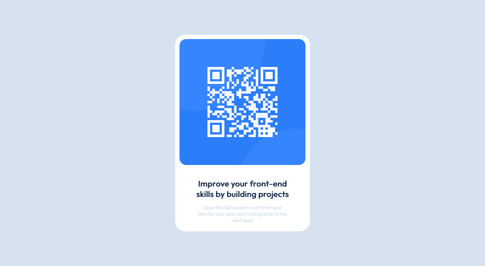

# Frontend Mentor - QR code component solution

This is a solution to the [QR code component challenge on Frontend Mentor](https://www.frontendmentor.io/challenges/qr-code-component-iux_sIO_H). Frontend Mentor challenges help you improve your coding skills by building realistic projects. 

## Table of contents

- [Overview](#overview)
  - [Screenshot](#screenshot)
  - [Links](#links)
- [My process](#my-process)
  - [Built with](#built-with)
  - [What I learned](#what-i-learned)
  - [Continued development](#continued-development)
  - [Useful resources](#useful-resources)
- [Author](#author)

## Overview

### Screenshot

### Links

- Solution URL: [Github repo](https://github.com/BlackstarDamien/qr-code-component)
- Live Site URL: [Github pages](https://blackstardamien.github.io/qr-code-component/)

## My process

### Built with

- HTML5
- CSS

### What I learned

I learned few things about CSS. I learend how to style components and how to center them.
Also I leanred something about media queries.

### Continued development
I want to be focused more on further learning of CSS since I have a tiny experience about that.

### Useful resources

- [5 ways to center div](https://dev.to/ruphaa/5-ways-to-center-a-div-vertically-and-horizontally-using-css-3i60) - This helped me in centering QR code component.
- [CSS margin vs padding](https://blog.hubspot.com/website/css-margin-vs-padding) - With this article I learned the difference between margin and padding, which allowed me to style components properly.

## Author

- Github - [BlackstarDamien](https://github.com/BlackstarDamien)
- Frontend Mentor - [@BlackstarDamien](https://www.frontendmentor.io/profile/BlackstarDamien)